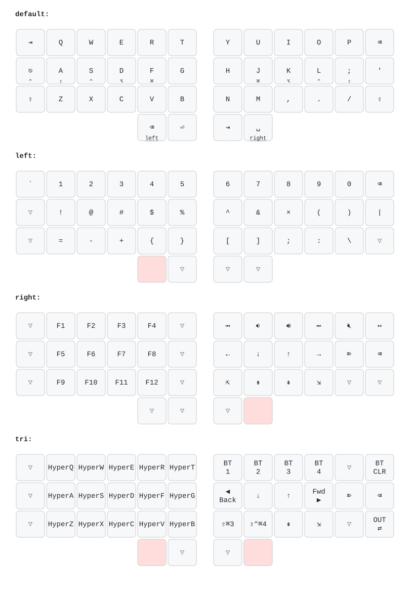

# zmk-config

Welcome to my [ZMK](https://zmk.dev) configurations. This is where my wireless keyboards are set up just the way I like them.

## [KarlKB](https://github.com/riesinger/karlkb)

After building & using the Sofle for a while, I've been getting more and more comfortable with dropping more keys.
Because of that, and because the Sofle isn't designed for wireless usage, I've designed my first fully custom keyboard myself.

Find the KarlKB's main repo [here](https://github.com/riesinger/karlkb).

### Layout

_The SVG above is auto-rendered on every push by [`.github/workflows/draw-keymaps.yml`](.github/workflows/draw-keymaps.yml) using [keymap-drawer](https://github.com/caksoylar/keymap-drawer)._

